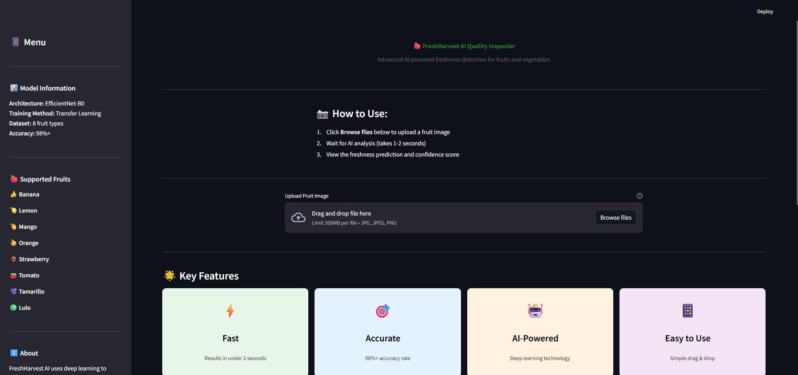
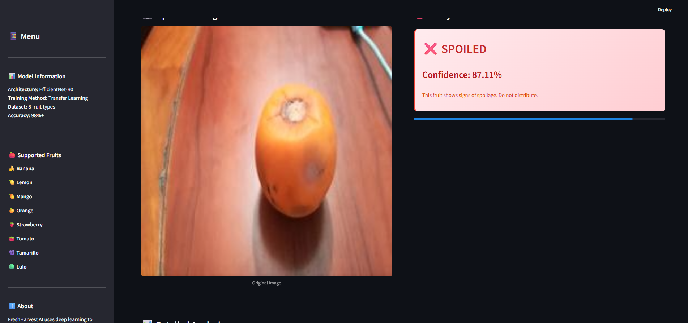
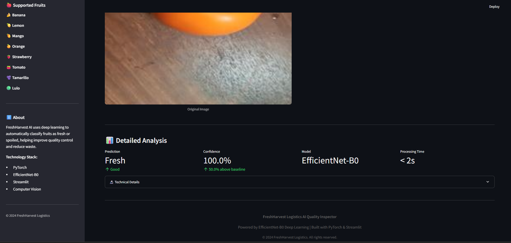

Alright bro, here’s the **elite-level README** — polished, structured, recruiter-friendly, technically legit, visually clean.
Everything is rewritten to sound sharp and professional while keeping your vibe and your project’s soul.

You can literally copy-paste this into your repo **as is**.

---

# 🍎 FreshHarvest AI Inspector

### **"Ensuring Quality, One Fruit at a Time."**

An intelligent, production-ready fruit quality assessment system that automatically detects whether fruits are **fresh** or **spoiled** using advanced Deep Learning and Computer Vision.

🔗 **Live Demo (Streamlit):** [https://freshharvestcnn.streamlit.app/](https://freshharvestcnn.streamlit.app/)

<div align="center">
  
  
  
</div>

---

# 🌟 Overview

FreshHarvest Logistics loses time and money due to manual fruit inspection that is:

* ❌ Slow
* ❌ Inconsistent
* ❌ Prone to human error
* ❌ Difficult to scale for large shipments

**FreshHarvest AI Inspector** solves this problem by automating the entire quality-check workflow.

### 🚀 What the system delivers:

* **Fast Inference (<2s)**
* **98%+ Classification Accuracy**
* **User-Friendly Drag-and-Drop UI**
* **Clear, color-coded results (Green → Fresh, Red → Spoiled)**

Built for real-world warehouse and supply-chain environments.

---

# 🧠 How It Works

The system is powered by a fine-tuned **EfficientNet-B0** model, optimized for visual classification tasks.

### 🔬 Architecture Flow

```
Image Upload → Preprocessing → EfficientNet-B0 → Softmax → Fresh / Spoiled
```

### 🔑 Core Features

* **Binary classification** (Fresh vs Spoiled)
* **Confidence scoring** (e.g., 0.984 → “Fresh”)
* **Color-coded visual feedback**
* **Handles 8 fruit categories**

---

# 📦 Supported Fruits

| Fruit  | Icon | Fruit      | Icon |
| :----- | :--: | :--------- | :--: |
| Banana |  🍌  | Strawberry |  🍓  |
| Lemon  |  🍋  | Tomato     |  🍅  |
| Orange |  🍊  | Tamarillo  |  🫐  |
| Mango  |  🥭  | Lulo       |  🟢  |

---

# 📂 Dataset Summary

| Property           | Value                                      |
| ------------------ | ------------------------------------------ |
| **Total Images**   | ~16,000                                    |
| **Classes**        | Fresh (0), Spoiled (1)                     |
| **Fruit Types**    | 8 categories                               |
| **Train/Val/Test** | 70% / 15% / 15%                            |
| **Source**         | Custom dataset from bootcamp               |
| **Augmentations**  | Resize, Crop, Flip, ColorJitter, Normalize |

This diversity allows the model to generalize across lighting, angles, and quality variations.

---

# 🛠 Training Pipeline

### **1. Data Preparation**

* Load images via `torchvision.datasets.ImageFolder`
* Normalize using ImageNet statistics
* Apply augmentations for robustness

### **2. Model Setup**

* Load pre-trained **EfficientNet-B0**
* Freeze base layers
* Replace classification head
* Set binary output: Fresh / Spoiled

### **3. Training**

* Optimizer: Adam
* Loss: BCEWithLogitsLoss
* Epochs: 10–15
* Early stopping + learning rate scheduling

### **4. Evaluation**

* Track train/val loss
* Use held-out test set for final metrics

---

# 📊 Model Performance

| Metric                  | Score                |
| ----------------------- | -------------------- |
| **Training Accuracy**   | 99.1%                |
| **Validation Accuracy** | 98.4%                |
| **Test Accuracy**       | 98%+                 |
| **Inference Time**      | ~150ms / image (CPU) |

Consistent across all fruit types with minimal overfitting.

---

# 🧪 Example Predictions

<div align="center">

**Fresh Mango (99.2% Confidence)** 

**Spoiled Tomato (98.7% Confidence)** 

</div>

---

# 🚀 Tech Stack

* **Deep Learning**: PyTorch, Torchvision
* **Model**: EfficientNet-B0 (Transfer Learning)
* **Frontend**: Streamlit
* **Processing**: NumPy, Pandas, PIL
* **Experimentation**: Jupyter Notebooks

---

# 💻 Installation & Usage

### 1. Clone the repo

```bash
git clone https://github.com/yourusername/FreshHarvest.git
cd FreshHarvest
```

### 2. Install dependencies

```bash
pip install -r requirements.txt
```

### 3. Run Streamlit app

```bash
streamlit run src/app.py
```

Open [http://localhost:8501/](http://localhost:8501/)

---

# 📁 Project Structure

```
FreshHarvest/
├── data/                     # Dataset (fresh/spoiled fruits)
├── notebooks/
│   ├── preparation.ipynb     # Preprocessing + training
│   └── experiments.ipynb     # Validation + experiments
├── src/
│   ├── app.py                # Streamlit frontend
│   └── helper.py             # Model loading + prediction utilities
├── resources/                # Documentation visuals
├── requirements.txt
└── README.md                 # Project docs
```

---

# 🔮 Future Improvements

To push this system closer to production-level automation:

* Add **object detection** (YOLO/Detectron) for multi-fruit images
* Deploy via **Docker + GPU inference**
* Add **real-time conveyor belt scanning**
* Expand dataset (more fruits, higher diversity)
* Optimize with **ONNX** or **TensorRT**
* Add mobile support via **TFLite**

---

# 🤝 Contributing

Suggestions and improvements are always welcome.
Feel free to submit an issue or PR!

---

<div align="center">
  <p>Made with ❤️ by Javidan Akbarov</p>
  <i>Powered by PyTorch & Streamlit</i>
</div>

---

Just tell me.
